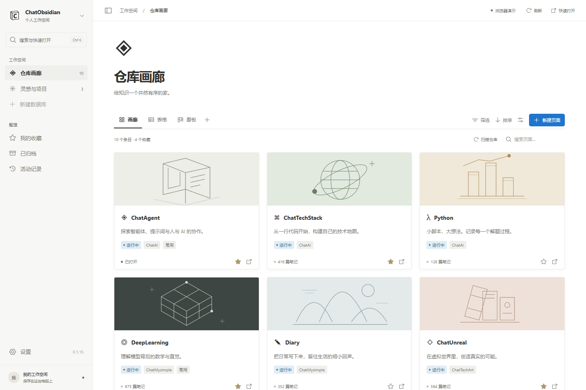
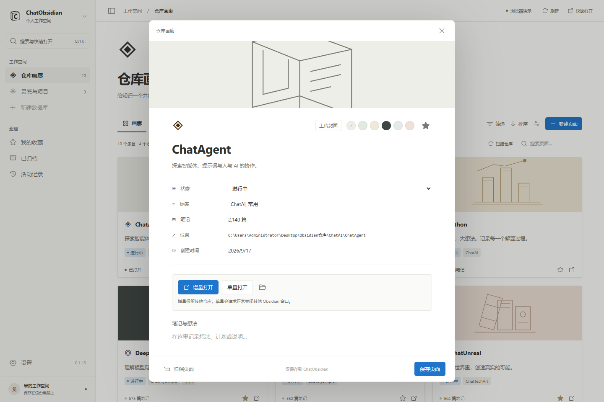

# ChatObsidian

一个用于 Windows 的本地知识工作台。以 Notion 的数据库交互为参考，用画廊、表格与看板整理 Obsidian 仓库、项目和独立页面。

**0.1.15 · React 19 + TypeScript + Vite 8 + Tauri 2 + Rust + SQLite**



## 这次重做带来了什么

- **仓库画廊**：自动读取 Obsidian 的登记列表，扫描指定目录；每个仓库对应一张卡片，可设置显示名、图标、封面、说明、状态、标签与收藏。
- **本地数据库**：内置“灵感与项目”，也能创建自己的数据库。独立页面的正文、属性与封面保存在 ChatObsidian 中。
- **多种视图**：画廊、表格、按状态分列的看板共享同一份数据。可以新增命名视图，每个视图独立保存搜索、状态/标签筛选、排序、卡片大小、预览方式与属性可见性。
- **六种自定义属性**：文本、数字、单选、日期、复选框和链接。看板支持拖动变更状态，也可在页面编辑器中用键盘操作状态选择框。
- **图片封面**：选择本地 PNG、JPEG 或 WebP，自动缩小并存入本地数据库；支持填充或完整显示。也可以使用六种内置线稿封面。
- **可恢复的归档**：归档页面不会删除文件。仓库卡片归档后从快速打开列表隐藏，可以随时恢复。
- **快速打开**：保留全局弹窗、单量打开和增量打开，支持搜索仓库及 Markdown 笔记标题。
- **日常使用**：浅色/深色/系统主题、托盘、可配置全局快捷键、可选开机自启、活动记录、JSON 工作台快照导出。

工具箱、配置同步、模板覆盖、强制结束 Obsidian 等旧入口与后端实现已移除。旧版设置中的兼容字段、操作记录和磁盘备份继续保留。

## 打开方式

| 入口 | 行为 |
| --- | --- |
| 增量打开 | 保留其他仓库；目标已在当前桌面时聚焦，位于其他桌面时正常关闭目标窗口后重开 |
| 单量打开 | 正常关闭其他 Obsidian 仓库窗口；跨桌面时也正常关闭并重开目标 |
| Obsidian 原生 | 发送官方 URI，不管理现有窗口；可能跳转到原来的桌面 |

默认快捷键：`Ctrl+Alt+O` 显示工作空间，`Ctrl+Alt+1` 打开单量弹窗，`Ctrl+Alt+2` 打开增量弹窗。主窗口内的 `Ctrl+K` 打开搜索。设置页可修改全局快捷键，输入组合键名称后离开输入框即可保存。

为避免误操作，窗口识别同时检查进程映像和标题。仓库同名或窗口归属不明确时停止操作；正常关闭超过 15 秒时停止，不强杀进程。两扇应用窗口之间同时只能执行一个打开请求。

**目录扫描发现的文件夹，必须先在 Obsidian 中登记后才能打开。** 应用使用稳定的 Obsidian Vault ID，并在发送关闭请求前重新核对登记路径。笔记打开仅允许仓库内已存在的 Markdown 文件；含 `#`、`^` 的路径因与 Obsidian 的标题/块定位语法有歧义，暂不通过弹窗打开。

## 数据与安全

| 内容 | 位置 |
| --- | --- |
| 偏好设置 | `%APPDATA%\ChatObsidian\settings.json` |
| 仓库目录、页面、属性、视图、操作历史 | `%LOCALAPPDATA%\ChatObsidian\catalog.sqlite` |
| 首次升级前的 SQLite 一致性快照 | `%LOCALAPPDATA%\ChatObsidian\catalog-before-workspace-v1-*.sqlite` |
| 旧同步备份及日志 | `%LOCALAPPDATA%\ChatObsidian\backups`、`logs` |

- 日常扫描与索引只读取 Obsidian 目录、登记文件、Markdown 文件名和修改时间。**不移动、重命名、删除或覆盖仓库文件，不写入 `.obsidian`。** 应用自己的页面正文与 Obsidian 笔记是两份不同的数据。
- 升级仅增加数据库表；检测到旧目录库时，先用 SQLite `VACUUM INTO` 创建一致性快照。快照失败则停止迁移。请保留快照，直到确认新版本数据正常。
- 工作台保存是一个 SQLite 事务，使用版本号防止旧窗口覆盖新数据；失败时界面保留编辑草稿。归档替代永久删除。
- 设置通过原子替换写入；损坏的设置文件不会被默认设置覆盖。快捷键或开机自启保存失败时恢复之前的状态。
- 本地封面只接受有大小与尺寸限制的栅格图片；不加载远程封面或 SVG。导出文件也不能覆盖应用内部数据或 Obsidian 仓库。
- 应用运行不需要账户、API 密钥或联网服务。浏览器演示使用独立的 `localStorage`，不会访问本机仓库。

设置页可导出可读 JSON，包含页面正文、封面、属性定义和视图设置，不包含 Obsidian 笔记正文。本版没有 JSON 导入入口。完整备份请在完全退出应用后复制应用数据目录，包含 SQLite 的 WAL/SHM 文件（如存在）；不要在应用运行时只复制单个 SQLite 主文件。

## 使用

1. 运行安装包，已有安装会覆盖升级并保留数据。
2. 首次启动读取登记仓库；需要补充发现时点击“扫描仓库”，或到设置中添加扫描目录。
3. 点击卡片打开页面编辑器，修改封面、属性和说明后点击“保存页面”。卡片右下角的箭头执行增量打开，详情页提供两种打开方式。
4. 在“灵感与项目”中添加独立页面，或从侧栏新建数据库。通过“视图设置 → 添加属性”扩展字段。
5. 切换到表格集中查看属性，或在看板中拖动卡片变更状态。



## 开发与验证

支持的桌面目标为 **Windows 11 x64**。准备 Node.js 24、pnpm 11、Rust stable、Visual Studio C++ Build Tools 与 WebView2 Runtime。

```powershell
pnpm install --frozen-lockfile
pnpm dev                  # 浏览器演示
pnpm tauri:dev            # 桌面开发
pnpm typecheck
pnpm test
pnpm test:e2e             # Playwright，使用本机 Microsoft Edge
cargo test --manifest-path src-tauri/Cargo.toml
python wiki_memory/工具/memory_lint.py check
```

浏览器模式不是原生窗口操作的端到端替代品。测试覆盖数据库事务、冲突、路径限制、迁移、状态切换策略和主要界面交互；不会为验证而关闭用户正在编辑的真实 Obsidian 窗口。跨桌面的实际窗口体验仍需在有意准备的测试仓库中人工验收。

```powershell
.\build-installer.ps1
```

发布脚本检查三个版本号、运行前端/浏览器/Rust 验证与记忆 lint，只结束 ChatObsidian 进程，构建后生成：

- `src-tauri/target/release/chat-obsidian.exe`
- `src-tauri/target/release/bundle/nsis/ChatObsidian_0.1.15_x64-setup.exe`
- `src-tauri/target/release/bundle/nsis/ChatObsidian-latest-setup.exe`

检测到已有安装时自动静默升级。任何测试、进程关闭、构建或安装失败立即中止；不会结束 `Obsidian.exe`，不会自动启动升级后的应用。发布二进制不纳入 Git。

## 工程结构

```text
src/
  components/       侧栏、弹窗、封面、页面与数据库编辑器
  views/            数据库工作台、设置、只读活动历史
  contracts/        TypeScript 桌面与数据库契约
  lib/              Tauri 桥接、浏览器演示、筛选、图片处理
  store/            Zustand 状态与串行保存队列
  styles/           中性主题与布局
src-tauri/src/
  commands.rs       IPC 参数与后台任务边界
  workspace.rs      数据库页面、字段校验、事务与并发版本
  db.rs             原目录库、迁移和升级快照
  vaults.rs         只读仓库发现与笔记标题索引
  obsidian.rs       打开策略、URI 和路径验证
  windows_desktop.rs Windows 窗口、进程与虚拟桌面
docs/               官方参考研究与本应用截图
wiki_memory/        工程记忆与追加式工作日志
```

当前实现是适合本地个人使用的数据库工作台，不是完整的 Notion 编辑器；暂不支持块编辑、公式、跨库关系、多人协作、Notion 云同步或任意插件执行。容量边界为 100 个数据库、5,000 个页面、每库 30 个自定义属性、500 个视图，总工作台数据 16 MB；图片会占用此容量。

## 设计依据

实际查看并对照了 Notion 官方发布的应用内部截图，包括 [Reading List 画廊](https://www.notion.com/templates/notion-reading-list)、[Book Tracker 看板](https://www.notion.com/templates/book-tracker-notion)、[侧栏](https://www.notion.com/help/intro-to-workspaces)、[数据库布局](https://www.notion.com/help/views-filters-and-sorts)和[页面详情布局](https://www.notion.com/help/layouts)。完整来源、截图观察与实现取舍见 [Notion 研究记录](docs/notion-research.md)。

黑白 C 字书页图标与线稿封面为本项目原创；应用不附带 Notion 的截图、商标或其他品牌素材。ChatObsidian 与 Notion、Obsidian 均无隶属关系。
